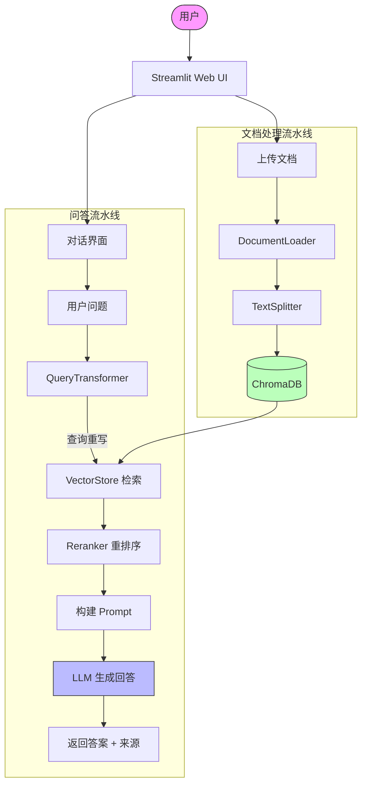

# 📚 智能 RAG 问答助手

> 基于检索增强生成 (RAG) 的智能文档问答系统 — 上传文档，智能问答

[](https://www.python.org/)
[](https://streamlit.io/)
[](LICENSE)

---

## ✨ 功能概览

| 功能 | 说明 |
|------|------|
| 📖 **多格式文档加载** | 支持 PDF / TXT / Markdown / DOCX / HTML / CSV / JSON / XML |
| ✂️ **多种分块策略** | 递归分块 / 语义分块 / Token 分块 / Markdown 标题分块 |
| 🔍 **智能检索** | 向量相似度 + BM25 关键词混合搜索，MMR 多样性保证 |
| 💡 **查询优化** | 查询重写 / HyDE / 子查询分解 / 查询扩展 / 退后提示 |
| 🎯 **结果重排序** | 关键词加权 / Cross-Encoder / Cohere Rerank |
| 💬 **多轮对话** | 对话历史管理，上下文连贯 |
| 📎 **来源追溯** | 每条回答附带可展开的检索来源 |
| ⚙️ **可配置** | 分块参数 / 检索策略 / 模型选择 / 重排序开关 |
| 🌐 **多 Embedding 后端** | OpenAI / Ollama 本地 / sentence-transformers 自动切换 |

---

## 🖥️ 界面预览

```
┌──────────────────────────────────────────────────────────┐
│  📚 智能 RAG 问答助手                    ┌──────────────┐│
│                                                │  📁 上传文档  ││
│  💬 用户: 什么是 RAG？                          │              ││
│                                                │  🚀 处理文档  ││
│  🤖 助手: RAG 是检索增强生成的缩写...              │              ││
│                                                │  📄 已处理文档 ││
│     📎 查看来源                                  │  ✅ test.pdf ││
│     ┌──────────────────────────┐                │              ││
│     │ [来源1] RAG 全称为...    │                │  📊 向量库状态 ││
│     └──────────────────────────┘                │  文档块: 42  ││
│                                                │              ││
│  ┌─────────────────────────────────┐            │  ⚙️ 系统设置  ││
│  │ 输入您的问题...                    │            │              ││
│  └─────────────────────────────────┘            └──────────────┘│
└──────────────────────────────────────────────────────────┘
```

---

## 🚀 快速开始

### 前置要求

- Python 3.10+
- **DeepSeek API Key** — 用于 LLM 问答（在 [platform.deepseek.com](https://platform.deepseek.com) 获取）
- （可选）Ollama — 使用本地模型

### 安装

```bash
# 1. 克隆项目
git clone https://github.com/Andychenx/rag-qa-assistant.git
cd rag-qa-assistant

# 2. 安装依赖
pip install -r requirements.txt

# 3. 配置环境变量
cp .env.example .env
# 编辑 .env 文件，填入你的 API Key 等配置
```

### 运行

```bash
# 启动 Web UI
streamlit run app.py
```

浏览器打开 `http://localhost:8501` 即可使用。

### 配置方式

系统支持三种配置方式（优先级从高到低）：

1. **环境变量**: 通过 `.env` 文件设置（推荐，详见 `.env.example`）
2. **UI 设置**: 运行后在侧边栏 ⚙️ 高级设置中调整
3. **默认值**: 见 `src/config.py`

> **💡 DeepSeek + Local Embedding 默认组合**
> 项目开箱即用默认配置为：**DeepSeek Chat** (LLM) + **all-MiniLM-L6-v2** (本地嵌入)。
> 只需在 `.env` 中填入 `DEEPSEEK_API_KEY`，即可开始使用，无需额外配置。

---

## 🏗️ 项目架构



### 目录结构

```
rag-qa-assistant/
├── app.py                      # Streamlit UI 入口
├── requirements.txt           # 依赖列表
├── .env.example              # 环境变量模板
├── README.md                 # 项目说明
│
├── src/
│   ├── __init__.py           # 包初始化
│   ├── config.py             # 配置管理
│   ├── document_loader.py    # 文档加载（PDF/TXT/MD/DOCX/CSV/JSON/XML/URL）
│   ├── splitter.py           # 文档分块（4 种策略）
│   ├── embeddings.py         # Embedding 封装（OpenAI/Ollama/Local）
│   ├── vector_store.py       # 向量存储与检索（ChromaDB + FAISS）
│   ├── qa_chain.py           # RAG 问答链 + 对话记忆
│   ├── query_transform.py    # 查询优化（重写/HyDE/子查询）
│   └── reranker.py           # 重排序（关键词/Cross-Encoder/Cohere）
│
├── tests/
│   ├── test_loader.py        # 文档加载测试
│   ├── test_splitter.py      # 分块测试
│   ├── test_retriever.py     # 检索测试
│   └── test_qa.py            # QA 与重排序测试
│
├── data/
│   └── sample_docs/          # 测试文档
│
└── chroma_db/                # 向量数据库持久化目录（运行时生成）
```

---

## 🧪 分块策略对比实验

### 实验设计

使用项目自带的测试文档（`测试文档.md`），对比不同分块策略的效果：

| 策略 | chunk_size | chunk_overlap | 块数 | 平均大小 | 适用场景 |
|------|-----------|--------------|------|---------|---------|
| 递归分块 | 200 | 50 | ~25 | 180字 | 短文本/对话 |
| 递归分块 | 500 | 100 | ~10 | 450字 | 通用 |
| 递归分块 | 1000 | 200 | ~5 | 900字 | 长文档/论文 |
| Token 分块 | 512 | 50 | ~8 | 450字 | LLM 输入准备 |
| 语义分块 | 2000 | — | 依文档结构 | 可变 | 结构化文档 |

### 影响分析

1. **chunk_size=200**: 检索精确但可能丢失上下文，适合短文本问答
2. **chunk_size=500**: 平衡的选择，大部分场景表现良好
3. **chunk_size=1000**: 上下文完整但检索精度略降，适合长文档
4. **chunk_overlap=50**: 基本保证上下文连续
5. **chunk_overlap=100**: 推荐值，覆盖大部分 边界情况
6. **chunk_overlap=200**: 冗余度较高，但上下文衔接更好

---

## 🧠 技术要点

### 核心流程

```
用户输入 → 查询重写 → 向量检索 + 关键词检索 → 混合融合 → 重排序 → LLM 生成 → 答案 + 来源
```

### 关键技术

| 技术 | 说明 |
|------|------|
| **RAG** | 检索增强生成，结合检索与生成的优势 |
| **DeepSeek Chat** | 默认 LLM 后端（OpenAI 兼容 API，可换 GPT/通义千问等） |
| **Local Embedding** | 默认嵌入后端（all-MiniLM-L6-v2，本地离线运行） |
| **Hybrid Search** | 向量相似度 + BM25 关键词，兼顾语义与词频 |
| **MMR** | 最大边际相关性，平衡相关性与多样性 |
| **HyDE** | 假设性文档嵌入，先生成假设答案再检索 |
| **Query Rewrite** | 多轮对话中的指代消解和上下文补全 |
| **Cross-Encoder** | 深度语义匹配模型，精确重排序 |
| **Chunk Strategy** | 不同的文档分块策略适应不同文档类型 |

### LLM 后端对比

| 后端 | 优点 | 缺点 | 适用场景 |
|------|------|------|---------|
| **DeepSeek** (默认) | 性价比高，中文优秀，API 兼容性好 | 需要网络 | 日常使用，推荐 |
| OpenAI (GPT) | 生态成熟，多模态支持 | 成本较高 | 需要多模态能力时 |
| Ollama 本地模型 | 完全离线，隐私安全 | 需 GPU | 离线环境 |

> **推荐搭配**: DeepSeek Chat (LLM) + all-MiniLM-L6-v2 或 BAAI/bge-small-zh-v1.5 (Embedding)
>
> 这样组合的原因：DeepSeek 不提供嵌入 API，但本地嵌入模型完全免费且效果足够；
> 同时 DeepSeek Chat 的 API 价格仅为 GPT 的 1/10 左右，中文效果出色。

### Embedding 后端对比

| 后端 | 优点 | 缺点 | 适用场景 |
|------|------|------|---------|
| **sentence-transformers** (默认) | 完全本地，免费，无需 API | 首次加载慢，中等精度 | 搭配 DeepSeek/本地 LLM |
| OpenAI 兼容 API | 精度高，可选多种模型 | 需要 API Key，有费用 | 需要最高精度时 |
| Ollama | 本地运行，免费 | 需要 GPU 性能较好 | 本地全栈离线 |

---

## 📊 测试

```bash
# 运行全部测试
python -m unittest discover tests -v

# 运行单个测试模块
python -m pytest tests/test_splitter.py -v
python -m pytest tests/test_retriever.py -v
python -m pytest tests/test_qa.py -v
```

---

## 🎯 面试考点

| 问题 | 考察点 | 项目体现 |
|------|--------|---------|
| Chunk Size 怎么选？ | 分块策略理解 | 做了对比实验，4 种策略可选 |
| 为什么检索结果不准确？ | 检索质量认知 | Hybrid Search + MMR + 重排序 |
| 多轮对话怎么做？ | 对话历史管理 | ConversationMemory + 查询重写 |
| 怎么评估 RAG 质量？ | 评测意识 | 可扩展测试框架 |
| 处理过什么边缘情况？ | 问题解决能力 | 空文档/空查询/无结果/超大文件 |

---

## 📋 后续计划

- [ ] 添加 RAG 质量评估脚本（BLEU / ROUGE / Answer Relevance）
- [ ] 支持更多文档格式（PPT / Excel / 图片 OCR）
- [ ] 多文档联合问答
- [ ] Docker 容器化部署
- [ ] 添加 GraphRAG 支持

---

## 📝 License

MIT License

---

<p align="center">
  <b>如果这个项目对你有帮助，请给一个 ⭐️</b>
</p>
